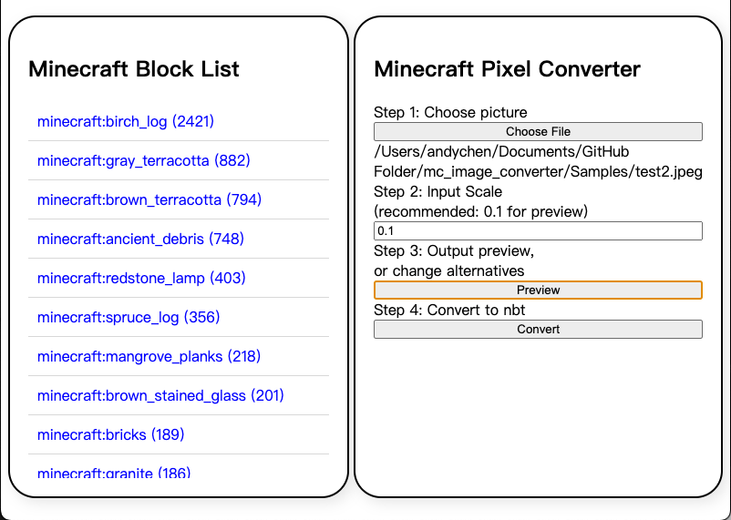

# mc_image_converter

This tool is used to convert images (jpg, png) into NBT files that can be built in Minecraft. Once you have the NBT file, you can quickly recreate the structure using Create's blueprint cannon or any other method that copies buildings based on NBT files. Of course, you can also simply use VSCode's NBT Viewer to render it in 3D, and then enjoy your hand build.

## How to use

[1] First Step: input file

This is the interface when you open the app. Press the "Choose File" button to choose the file to input.

[2] Second Step: Choose scale

Here, you can choose the scale for the convert image, 1 means 100% resolution of the original image, 2 means double the size of width and height, which means 4 times bigger. In the beginner, I recommend using 0.1 to check if everything working fine.

[3] Step 3: Ourput preview

When you press preview, the left part of the app will show the name of the block and how many of each to build the structure.

If you press any of them, there will pop out a message box containing all the alternatives, those are sorting based on the distance of color. You can press any of them, that particular block will change to what you choose.

[4] Step 4: convert to nbt file

After you decide all the block you want to use, press the "Convert" button, the app will make all the structure detail to a nbt file, which is ofter used in minecraft.

There are lots of mod that can convert nbt structure plan to a real building in minecraft world. You can use any of them to build the structure easily.

Of course, building by your own hand is also an option, use the "nbt viewer" extension of vscode, you can 3D-lize your nbt file. And you can base on that to build your own structures.

This is the result I get for test1 with 0.7 scale, if you look closer, every pixel is build by minecraft block, using some block with multiple color in one block will make the result more fancy.

---
I use electron to compile my app to an executable file, which is in "dist" folder, there are also have protable version of the app in "mac-arm64" folder, depends how you want to use it.

The image in Samples folder are download from non-copy-right website.

The color data of minecraft block are prepared based on vanilla minecraft. 